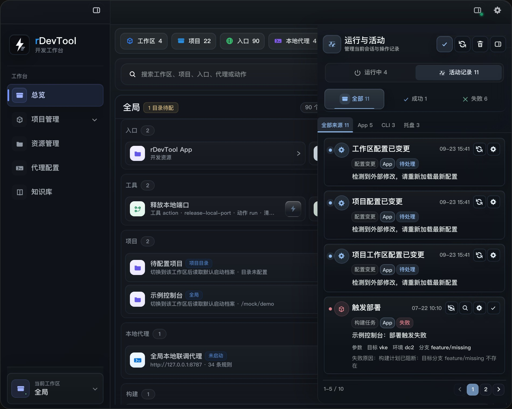

# 运行与活动：运行状态、活动记录与失败处理

## 这一区域解决什么问题

右上角的 **运行与活动** 是 rDevTool 的跨页面运行入口。它把当前工作区可见的项目服务、本地构建、参数化 Action、本地代理、受控浏览器、联调 Link、Git/部署结果和配置变化放到一个侧栏中，帮助你回答两件事：

1. **现在有什么正在运行？** 例如哪个项目占用了端口、哪个代理正在监听、哪个 Action 仍在执行。
2. **刚才发生了什么？** 例如构建是否已经获得最终状态、Git 批量任务哪个项目失败、配置文件变化是否需要重新加载。

活动中心是本机工作台的观察和处理入口，不替代 Jenkins、GitLab、浏览器 DevTools 或操作系统进程列表。对远程构建、部署、合并和推送，最终结果仍要以目标系统或页面结果链接为准。



上图展示侧栏中的活动类型筛选、失败/进行中状态、关联入口和分页。实际数量与记录内容会随当前 Workspace 和本机运行状态变化。

## 打开与作用域

点击窗口右上角的活动图标打开侧栏。有运行资源时图标显示运行指示灯。再次点击或点击侧栏收起按钮即可关闭。

活动记录随当前 Workspace 重新计算：

- 在需求工作区中，普通项目记录只显示属于当前工作区项目的活动；配置变化和 Link 记录仍可用于当前工作区。
- 在 `system` 全局视图中，可以查看全部项目范围的运行与活动。
- 切换工作区不会删除历史，只会改变当前页面可见的范围。执行前先确认左下角 Workspace 切换器和活动中心标题对应的是同一个范围。

## 两个主视图

### 运行中

**运行中** 面板显示当前已观测到的运行资源，按以下分组排列：

- **当前工作区**：当前需求直接关联的项目服务、构建或 Action。
- **其他工作区**：仍在本机运行，但不属于当前需求范围的项目服务或构建。
- **共享服务**：代理 profile、受控浏览器等不属于某一个项目的共享资源。

顶部摘要会显示运行资源数量、活跃端口数量、端口冲突、外部进程和最近观测时间。状态超过约 45 秒没有新的观测时，会提示状态可能已过期；点击刷新运行状态重新读取本机状态。打开“运行中”视图时会自动刷新，页面保持打开时也会定期刷新。

每个运行资源可能提供以下按钮，按钮是否出现取决于资源归属和当前状态：

| 按钮 | 用途 | 使用建议 |
| --- | --- | --- |
| 认领 | 将可识别的外部项目进程纳入 rDevTool 管理 | 先确认项目目录、端口和命令确实属于当前项目 |
| 聚焦 | 聚焦项目页面或已启动的应用 | 只改变窗口焦点，不代表服务健康 |
| 打开日志 | 打开该项目或构建的日志文件 | 进程退出后先看日志，再判断是否需要重启 |
| 打开产物目录 | 打开本地构建或打包产物目录 | 先确认产物属于本次运行 |
| 打开项目目录 | 打开实际生效的项目目录 | 工作区副本和仓库目录可能不同，按页面显示路径判断 |
| 查看详情 / 深度诊断 | 查看运行上下文，或检查端口监听和进程归属 | 端口异常时优先使用深度诊断 |
| 停止 | 停止 rDevTool 已确认归属的运行资源 | 会弹出确认；外部进程必须先认领或在所属工具中处理 |

资源类型包括 **项目服务**、**本地构建**、**参数化 Action**、**本地代理** 和 **受控浏览器**。运行中的 Action 还会显示阶段和最后一行输出；如果包含 secret 参数，实时输出可能被隐藏，只能在结束后查看统一脱敏结果。

#### 端口冲突和外部占用

端口相同不一定就是冲突：监听地址、进程 PID 和项目目录也会参与判断。活动中心会区分：

- **端口冲突**：两个可观测资源可能监听同一端口，需要比较项目、地址和进程。
- **外部进程**：端口被非 rDevTool 管理的进程占用，不应直接强制停止。
- **无法确认端口**：项目状态显示运行中，但没有可解析的端口，优先打开运行面板和日志。

深度诊断会显示端口、检查时间、监听进程、PID、命令、工作目录以及是否匹配预期 PID/目录。只有归属证据充分时才执行停止。

### 活动记录

**活动记录** 保存跨页面操作的最近结果。顶部工具栏提供：

- 标记全部失败已处理：只移除待处理提醒，不删除记录。
- 刷新活动状态：对仍在运行或状态同步失败的构建重新读取 Jenkins 状态。
- 清理已处理记录：需要确认；删除成功、信息和已确认失败记录，待处理与正在运行的记录会保留。
- 收起：关闭侧栏，不影响运行资源。

活动记录页有两层筛选：

| 筛选 | 内容 |
| --- | --- |
| 全部 | 当前作用域内的活动记录，包括进行中、失败和普通历史 |
| 成功 | 终态为成功的记录 |
| 失败 | 明确失败的记录；构建状态同步提示单独处理 |
| 全部来源 / App / CLI / 托盘 | 按活动产生来源筛选 |

当前活动中心没有独立的关键词搜索，也没有收藏筛选。需要精确找某个项目或资源时，先从项目、构建、Git、资源或代理页面进入对应的 Record，再用活动卡片上的 **打开关联资源**、**定位** 或诊断按钮回到上下文。

列表按最近更新时间倒序展示，每页最多显示 5 个展示单元。连续构建会合并成一个执行组，带有多次执行数量；带 `chainId` 的联调链或工作流会合并成一条链路。页脚显示当前范围和分页，不要把分页数量误认为数据库中的全部历史数量。

## 活动卡片怎么读

先从上到下读卡片，不要只看颜色：

1. **标题与时间**：确认是哪一类操作、最后更新时间是什么时候。
2. **类型和来源**：例如运行、构建任务、Git 工作流、本地代理、联调链路、配置变更，以及 App/CLI/托盘来源。
3. **外层状态**：卡片可能是进行中、完成、失败或记录；带可处理动作的活动会显示为待处理。
4. **项目与摘要**：确认项目名、操作摘要、构建号或远程队列信息。
5. **参数摘要**：展开或查看参数区，区分本次实际值和默认值；敏感值只显示已配置或脱敏结果。
6. **动作按钮**：打开资源、定位工作区、查看诊断、重试或标记已处理。

### 三种展示单元

- **普通活动**：一次运行、打开入口、代理操作或配置变化，卡片直接显示摘要和详情。
- **执行组**：同一项目和执行标识下的连续构建/部署，折叠时显示最新结果和成功/失败数量，展开后查看最近三次执行；有更多记录时可以继续展开。
- **链路组**：一个 Link、工作流或多步骤任务的多个阶段，展开后按创建顺序显示每一步，例如检查、启动、等待、停止和最终结果。

展开详情后，时间线中的失败项会标出失败原因；构建记录还可能保留 Jenkins 队列 URL 或构建 URL。URL 是结果入口，不等于 rDevTool 已经观测到远端最终成功。

## 安全重试规则

重试按钮只会出现在活动记录带有明确恢复动作时。点击后会先打开确认弹窗，并重新校验当前配置：

- Git 重试会重新检查工作区、项目、源/目标分支和权限上下文。
- 构建重试会重新生成计划，确认项目、目标、分支、环境和覆盖参数仍然有效。
- Runtime 重试会重新检查项目、启动档案、端口和受管进程；停止操作会再次确认进程归属。
- 代理重试会重新读取 profile、端口和监听归属，不会因为历史状态直接强行停止或启动。
- Link 重试会先执行只读检查，检查通过后才重新启动或停止。

远程 POST 已经可能被接收但客户端没有拿到响应时，不要直接重试。先打开远程任务链接、Jenkins/GitLab 页面或业务系统确认是否已经产生任务。

## 状态和“完成”的边界

| UI 状态 | 含义 | 下一步 |
| --- | --- | --- |
| 进行中 | 本地进程、Action 或远程构建仍在处理 | 去“运行中”看资源、日志和端口；远程构建等待状态同步 |
| 完成 | 本次操作返回成功或本地动作结束 | 需要远端终态时打开结果链接核对 |
| 失败 | 已得到明确失败结果 | 查看失败原因、诊断和项目行，修复后重新计划 |
| 记录 | 信息性事件或已过期的旧运行状态 | 作为上下文保留，不把它当成当前运行 |
| 待处理 | 有未确认的失败或可执行动作 | 先定位证据，再重试或标记已处理 |
| 已确认 | 失败提醒已接手 | 记录仍保留，清理时才可能被移除 |

活动中心遵循四个证据层级：

1. `executed`：本地或远程操作已被接受。
2. `persisted`：本机持久化历史中已有 operation/history 记录。
3. `activityVisible`：活动中心已经同步到该记录。
4. `verified`：实际观测到符合预期的终态，例如 Jenkins 构建成功、进程监听正确端口、远程提交存在。

按钮恢复为空闲、出现构建 URL 或显示“完成”都不能单独证明第四层。对发布、推送、部署、合并和外部服务，必须保留结果链接、构建号、commit、运行 ID 或日志路径。

## 与业务页面 Record 的分工

活动中心适合跨模块回答“最近发生了什么”和“现在谁需要处理”；业务页面的 Record 适合回答“这一个构建/Git/Action 的完整参数和逐项目结果是什么”。

- **项目运行面板**：看启动档案、预检、运行配置、实时日志和网页动作；活动中心看跨项目运行资源和启动结果。
- **构建页面**：看构建目标、参数默认值、本次覆盖和连续构建历史；活动中心看所有模块的统一状态和 Jenkins 同步。
- **Git 页面**：看合并、建分支、提交推送和副本管理的逐项目结果；活动中心提供失败提醒和安全重试入口。
- **本地代理**：看服务、规则和请求明细；活动中心看代理是否运行、请求数量、异常数量和最近请求。
- **资源入口/Link**：看具体步骤和参数；活动中心看 Link 链路是否卡在检查、启动或停止。

## 常用排查流程

### 项目页面显示已结束，但服务仍占端口

1. 打开 **运行中**，看该服务属于当前、其他工作区还是共享服务。
2. 查看端口、PID、工作目录和运行时状态。
3. 点击 **深度诊断**，确认监听进程是否匹配预期 PID 或目录。
4. 只对已确认归属的资源执行停止；外部占用先去所属工具或终端处理。
5. 回到项目运行面板查看日志，并保留活动记录中的运行 ID 和路径。

### Jenkins 构建一直显示进行中

1. 展开活动卡片，确认是队列 URL 还是构建 URL。
2. 等待自动状态同步，必要时点击刷新活动状态。
3. 如果出现“状态同步失败”，检查 Jenkins 地址、登录态、网络和返回内容；连续同步失败达到上限后需要手动处理。
4. 直接打开 Jenkins 队列/构建页面确认真实状态，不要因为前端状态没有更新就重新触发构建。

### 批量 Git 或 Action 部分失败

1. 打开“活动记录”，切换到“失败”并确认失败项目。
2. 展开执行组或链路组，阅读每个项目的分支、参数、HTTP 状态和诊断。
3. 成功项目不重试；只对明确支持恢复的失败项使用“检查并重试”。
4. 403、冲突、受保护分支和工作树阻断应先修复外部条件，再重新生成计划。
5. 完成处理后标记失败已处理，保留记录直到复盘完成。

## 本机数据、清理与安全

活动记录保存在本机应用存储中，当前最多保留最近 60 条归一化记录，并优先保留仍需处理的项目。应用启动时会从本机活动存储、构建/合并历史和 operation event history 重新整理记录；重复事件会去重，跨天且无法确认仍在运行的旧运行项会降级为信息记录。

清理只作用于当前可见范围内可清理的记录；正在运行和待处理记录会保留。清理前建议把以下信息写入脱敏后的知识库或工作日志：项目 Key、工作区、操作类型、时间、计划/运行 ID、结果链接、commit、错误类型和下一步。不要把 token、密码、Cookie、Authorization、私钥或完整业务响应写入活动摘要、日志共享内容或截图。

## CLI 对照

需要脚本或 AI Agent 复核时，活动中心只是 UI 汇总，持久化 operation/history 才是更适合机器读取的证据：

```bash
rdevtool --json history operations --limit 24
rdevtool --json history operations --domain build --project <project> --limit 12
rdevtool --json history operations show <operation-id>
rdevtool --json history build --latest --project <project> --env <env>
rdevtool --json history replay-plan build:<history-key>
```

`history replay-plan` 只生成新的只读计划；只有检查 `planHash`、目标、参数和风险都符合预期时，才进入 `history replay-run`。活动中心里显示的重试按钮同样遵循先检查、再确认、后执行的顺序。

## 快速判断表

| 你看到的现象 | 先看哪里 |
| --- | --- |
| 有失败活动 | 活动记录 > 失败，先读失败原因和恢复动作 |
| 有运行指示灯 | 运行中 > 当前工作区/其他工作区/共享服务 |
| 构建 URL 已出现但状态未知 | 打开 Jenkins 队列或构建页，活动中心只负责同步 |
| 端口被占用 | 运行中 > 深度诊断，确认 PID 和目录归属 |
| 配置文件被外部修改 | 活动记录 > 全部，打开对应记录的重新加载或比较入口 |
| 记录太多 | 先筛选来源/结果，复盘完成后清理已处理记录 |
