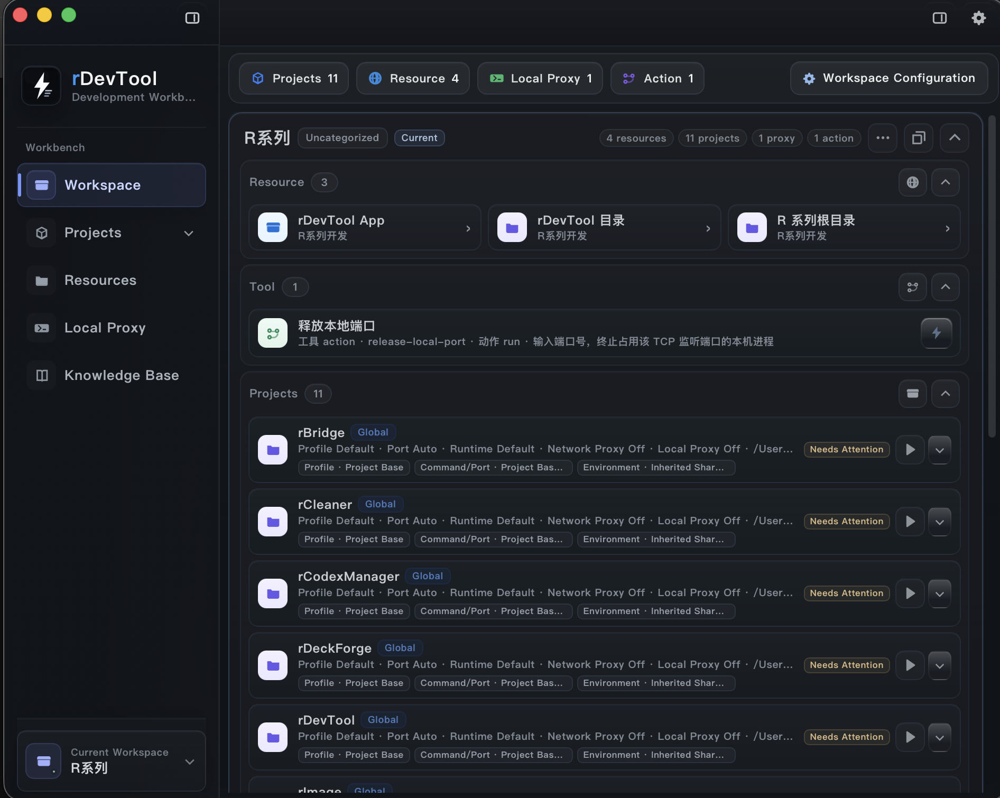
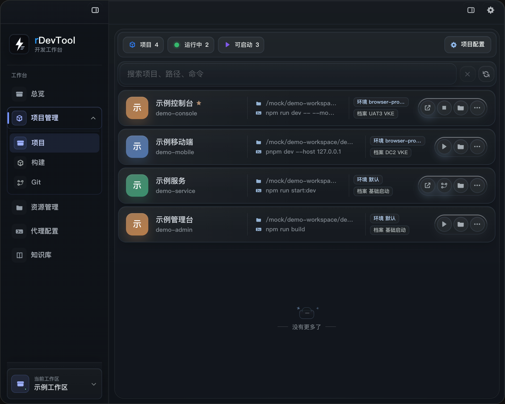
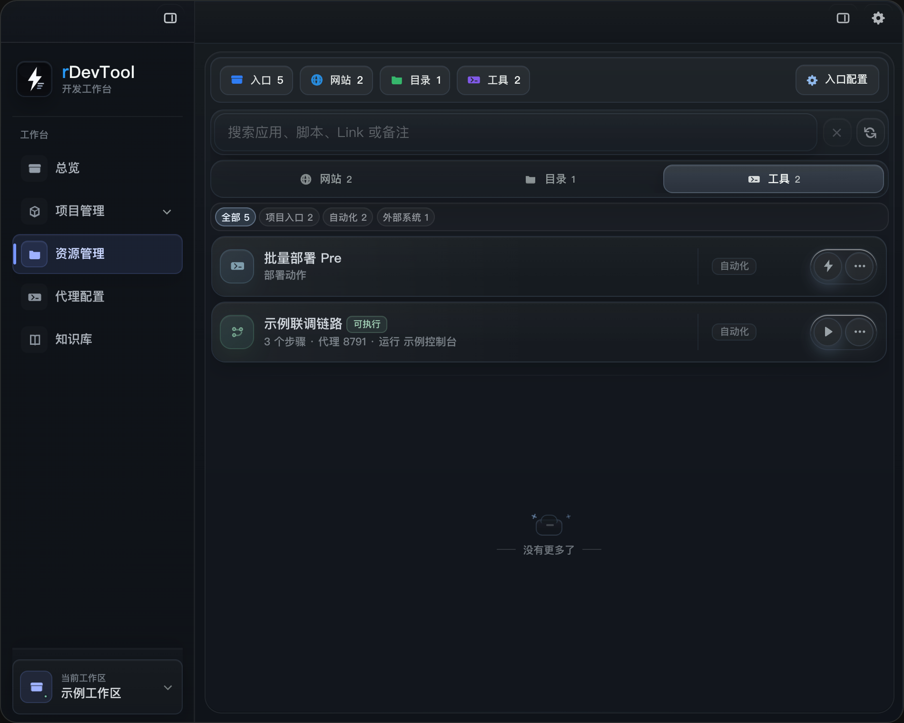
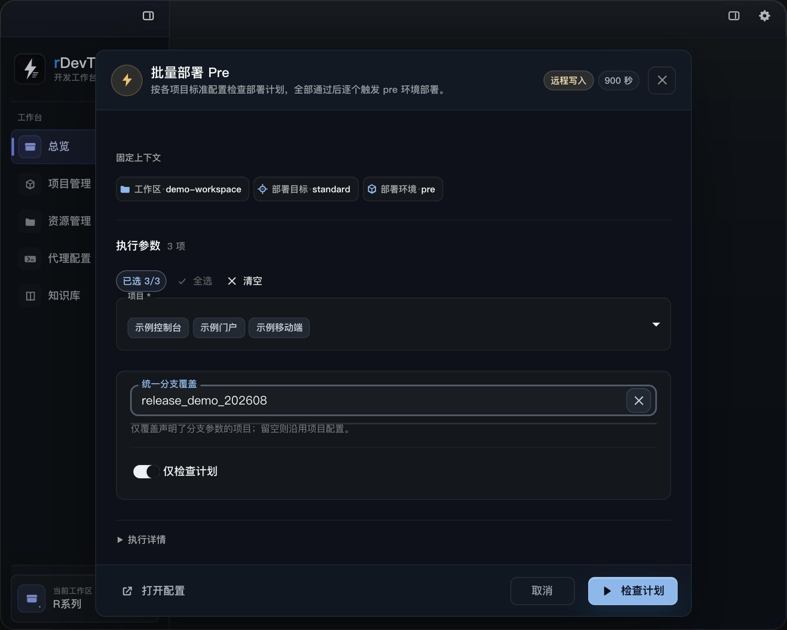
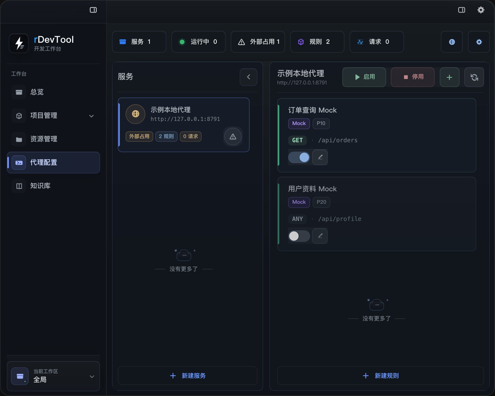
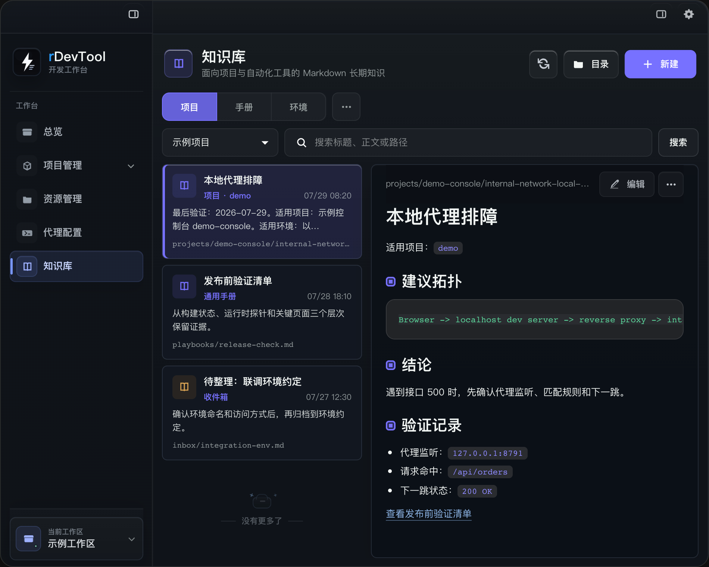
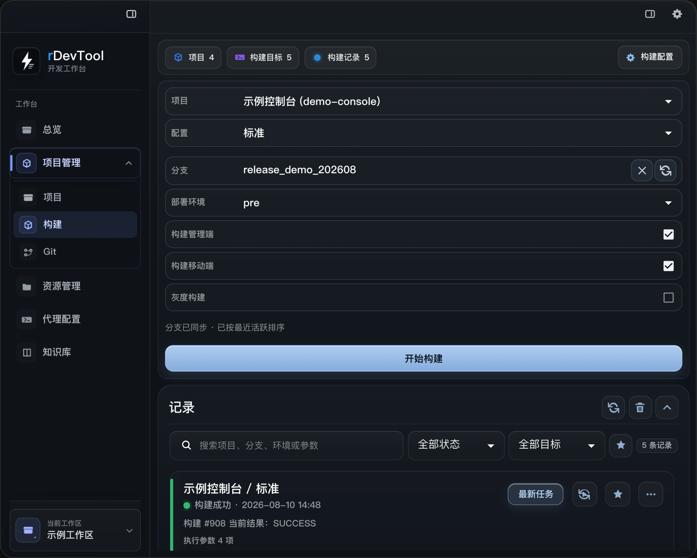
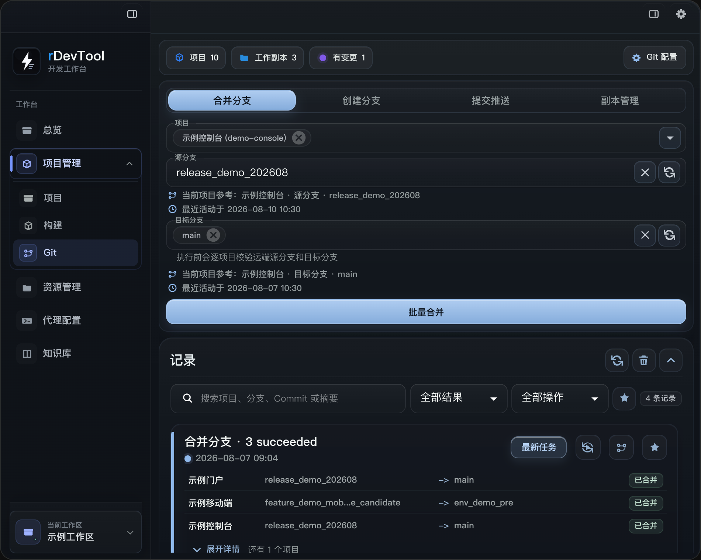

# rDevTool 完整使用手册

rDevTool 是面向多项目日常开发的本地工作台。你可以在同一个工作区里查看项目、切换分支、触发构建或部署、打开常用资源、启动代理和运行服务，并从 Record 中核对每次操作的参数、结果和失败原因。

本手册按界面中的实际任务组织。截图使用 mock 数据，不包含真实仓库、内网地址或凭据。

## 开始前先认识三个对象

- **工作区**：决定当前看到哪些项目、资源、代理和记录。`system` 是全局视图；普通工作区通常对应一个需求或一组相关项目。
- **项目**：保存仓库目录、Git 地址、启动命令、构建目标、启动档案和分支规则。
- **Action**：挂在资源入口上的可复用动作，例如批量部署、检查环境或运行本地脚本。Action 会自己声明参数、影响范围和确认方式。

切换工作区不会改动项目本身，只会改变当前操作范围。页面顶部或弹窗中的工作区、目标环境等固定上下文，应在执行前核对。

## 首次配置

建议按以下顺序完成第一次配置。

1. 打开右上角 **设置**，进入 **系统诊断**，先处理配置目录不可读、可执行文件不一致、存储异常等阻断项。
2. 进入 **项目管理 > 项目**，新增或打开项目，填写名称、项目 Key、仓库目录和 Git 地址。
3. 在项目配置中补充本地启动/构建命令；需要多个运行环境时，再添加启动档案、端口、启动页面和环境变量。
4. 在 **构建** 配置中添加构建目标。Jenkins 目标需要选择连接配置和 Job；本地目标需要确认命令与工作目录。再为目标添加分支、环境、布尔开关等参数。
5. 在 **Git** 配置中检查默认目标分支、同步目标和受保护分支约定。
6. 从左下角工作区切换器打开工作区管理，创建需求工作区并选择相关项目、资源入口和代理。暂时不需要收敛范围时，可以继续使用 `system`。
7. 进入 **资源入口**，确认当前配置源能加载网站、目录、应用、脚本和 Action。团队配置与个人配置并存时，先核对页面显示的配置源名称。
8. 先执行一次只读检查或计划，再进行推送、合并、构建、部署等写入操作；完成后到 Record 或活动中心确认结果已经保存。

密码、token、cookie 和私钥应来自环境变量或私有本机配置，不要填写到备注、知识库或普通命令参数中。

## 界面导航

左侧导航默认包含 **工作区**、**项目管理**、**资源入口**、**本地代理** 和 **知识库**。项目管理展开后包含 **项目**、**构建** 和 **Git**。右上角提供运行与活动、设置入口；`Cmd/Ctrl + K` 可以快速搜索项目、资源和常用动作。

设置里的 **通用** 页面可以调整默认页面、显示的菜单、主题、界面语言和退出应用时如何处理已启动项目。

## 工作区页面

Workspace 首页按应用默认窗口比例展示当前需求范围：顶部汇总项目、资源、代理与 Action，主体按资源、工具和项目分区，左下角始终标明当前工作区。

工作区页面用于回答“我现在在哪个范围里工作”。

- 查看当前工作区包含的项目、资源、代理、运行状态和最近操作。
- 从工作区切换器进入 `system` 或某个需求工作区；切换完成后，各页面会按新范围刷新。
- 创建需求工作区时，选择项目与资源范围，并按需要设置根目录、资料目录和工作日志。
- 工作区实例存在时，优先确认页面展示的实际目录和分支，避免把系统项目目录误当成当前需求副本。
- 外部配置发生变化时，应用会给出刷新或比较入口。先完成或取消正在编辑的内容，再切换配置源或重新加载。

日常开始一个需求时，先切换到对应工作区，再进入项目、Git 或构建页面；临时排查所有项目时再回到 `system`。

## 项目管理

### 项目

项目页用于查找、启动和配置项目。

- 使用搜索、分类、收藏和最近使用快速定位项目。
- 打开项目详情后，先核对仓库目录、当前分支和运行状态，再执行打开目录、启动、停止、重启或聚焦页面等动作。
- 项目配置按基础信息、本地命令、启动档案、构建目标和分支规则组织。保存后页面会重新读取有效配置。
- 启动前预检会检查工作目录、命令、端口和本地依赖。被阻断时先按提示修复，不要连续点击启动。
- 多个启动档案用于区分本地、联调、UAT 等运行方式；切换档案时注意端口、环境变量、代理和启动页面是否同时变化。

截图中的每一行项目都包含三个层次：左侧是项目身份和 key，中间是仓库路径与命令，右侧是当前启动档案和快捷操作。绿色状态表示 rDevTool 管理的运行服务；外部占用表示端口存在但归属未确认；待配置表示还需要先补启动命令或目录。

项目显示为不可用时，优先检查仓库目录是否存在、当前工作区是否引用了正确实例，以及配置源是否加载成功。

### 构建

构建页把 Jenkins、本地命令和 R Series 打包统一为“项目 + 构建目标 + 参数”。

1. 选择项目和构建目标。
2. 检查计划中解析出的工作目录、Job、分支、环境和参数默认值。
3. 只修改本次需要覆盖的参数；留空项继续使用目标默认值或当前分支。
4. 通过确认后开始执行。远程任务被接受后，页面会保留任务或构建链接。
5. 在 Record 中查看最新状态；需要完整参数、默认值或连续运行明细时展开卡片。

按钮从 `Running` 恢复为空闲只代表当前前端请求已结束。是否真正触发成功，应以 Record 中新增的 operation、远程任务链接和最终状态为准。

### Git

Git 页面用于查看分支状态，并执行同步、创建、检出、切换、合并和推送。

- 操作前核对项目实际目录、当前分支、源分支、目标分支和未提交修改。
- 批量同步或合并先查看计划；任何项目被阻断时，先处理对应项目，不要把部分计划当成全部通过。
- 推送前检查上游分支、待提交文件和提交说明。工作树不符合预期时返回项目目录处理。
- 合并完成、权限拒绝和冲突都会写入 Branch Record；展开记录可以看到每个项目的完整分支和建议动作。

## 资源入口与通用 Action

资源入口集中展示网站、目录、应用、脚本、Link 和通用 Action。可以按类型或分类过滤，并使用搜索、收藏和最近使用。

- 网站、目录和应用会直接打开目标。
- 普通脚本会按已配置命令启动；带参数、校验或结果协议的任务应使用 Action。
- Link 会把本地文件检查、代理、运行服务和打开页面等步骤组成一条可预览的联调流程。
- 页面数据为空或内容不对时，先核对当前工作区和资源配置源，再刷新或打开配置源比较。

顶部指标告诉你当前工作区一共有多少入口，以及网站、目录、工具的数量。类型切换用于收窄列表；分类标签用于在同一类型里按项目入口、自动化、外部系统等分组。闪电按钮通常进入 Action 确认，播放按钮通常运行 Link 或脚本，更多按钮用于收藏、复制路径或打开配置。

### Action 弹窗怎么用

1. **先看固定上下文**：工作区、部署目标、环境等不能在弹窗中临时改写，用来确认实际作用范围。
2. **再填执行参数**：项目多选会完整换行展示已选项，并提供全选和清空。统一分支覆盖只影响声明了分支参数的项目；留空时沿用项目默认值或当前分支。
3. **检查执行方式**：支持计划的 Action 会先生成只读计划，再显示实际目标与阻断原因；标记为 Remote Write 但仍直接执行的 Action 会展示额外警告。
4. **确认后执行**：参数或计划发生变化时，需要重新检查，旧结果不会继续沿用。
5. **观察运行状态**：运行中可以查看实时日志、取消任务或转到后台。结束后使用结果链接和 Record 核对实际结果。
6. **谨慎重试**：只有明确标记为可重试的失败项才会出现重试入口。远程请求结果不明确时，先去目标系统确认，避免重复触发。

## 本地代理

本地代理页按 profile 管理监听地址、端口和规则，并显示当前运行状态与最近请求。

- 启动前确认监听端口没有被其他进程占用。
- 规则可以用于转发、Mock、阻断或调整请求/响应；更改后重新检查 profile 状态。
- 项目启动档案可以引用代理 profile。项目联调异常时，同时核对项目运行状态、代理是否运行、规则是否命中以及上游地址是否可达。
- 诊断详情用于定位端口冲突、无效 URL、规则错误或配置源缺失；不要仅凭“进程已启动”判断请求链路可用。

左侧服务卡片表示一个可启动的代理 profile；右侧是该 profile 下的规则。外部占用不是成功运行，而是端口正在被非 rDevTool 进程监听，需要先确认归属。规则开关只改变当前规则是否参与匹配；新增、编辑、导入和导出代理包会影响配置源，团队共享前应复核里面没有敏感 Header、Cookie 或上游地址。

## 知识库

知识库保存可长期复用的 Markdown 资料，支持收件箱、项目经验、通用手册和环境约定等范围。

- 使用搜索和范围筛选定位文档；选择项目范围时，只查看该项目相关知识。
- 可以从模板新建笔记，预览正文，或在外部编辑器中继续编辑。
- 项目经验适合记录已验证的启动方式、环境约定和故障处理；通用流程放到手册，跨项目环境说明放到环境约定。
- 不要保存 token、cookie、私钥或一次性业务数据。知识库内容会作为长期资料被后续任务读取。

推荐一篇笔记只解决一个问题，例如“本地代理排障”“发布前验证清单”或“某环境启动约定”。左侧列表用于按更新时间和范围找资料，右侧预览用于快速读取；需要改正文时点编辑交给本机编辑器，回到应用后刷新。

## 设置与系统诊断

右上角 **设置** 包含以下常用区域：

- **通用**：菜单显示、默认页面、主题、界面语言和退出时的运行服务处理方式。
- **操作确认**：控制哪些高风险操作必须再次确认。关闭确认会降低保护，不建议作为解决操作失败的方法。
- **快捷入口**：打开配置目录、工作区目录和相关配置文件。
- **受管产物**：查看 rDevTool 明确管理的工作区实例、运行状态、日志和引用路径；清理前先阅读只读计划。
- **系统诊断**：检查当前应用/CLI 身份、配置健康、存储占用和可处理风险。

项目自身的启动、构建和分支配置从 **项目管理 > 项目** 进入。资源、Action、Link、代理和运行配置可以来自不同配置源，排查时应记录页面当前显示的来源。

## 活动中心与 Record

右上角 **运行与活动** 汇总 Action、构建、Git、Runtime、代理、Link 和外部配置变化；各业务页面的 **Record** 则更适合查看同类任务历史。

- 先看卡片标题、时间和外层状态，再看项目行或参数摘要。
- 使用搜索、结果类型、操作类型和收藏过滤缩小范围。
- 最新任务标签表示该卡片对应当前同类任务的最新一条记录，不等于执行成功。
- 展开详情可查看完整参数、逐项目结果、诊断、运行时间线和结果链接。
- 刷新用于重新读取持久化记录；删除或清理前先确认不再需要排查证据。
- 重试会重新检查当前配置和目标，不应假设历史参数仍然有效。

### 构建页面与 Build Record

截图展示完整的 **项目管理 > 构建** 页面：左侧保持当前功能定位，右侧上方用于选择项目、构建目标和实际参数，下方 Record 保留本次执行证据。

- 折叠状态优先显示相对默认值发生变化的参数；展开后显示全部执行值和默认值。
- token、密码等敏感值只显示是否已配置，不显示原文。
- Jenkins 权限、CSRF 和 HTTP 错误会保留状态码与建议检查项。
- 同一目标的连续运行可以展开为时间线，逐次查看构建号和结果。
- 固定记录使用小标签表达，不再通过不同卡片底色暗示另一种结果状态。

### Git 页面与 Branch Record

截图展示完整的 **项目管理 > Git** 页面：右侧上方可切换合并、创建、提交推送和副本管理，并核对项目与源/目标分支；下方 Branch Record 逐项目保留结果。

- 一条批量任务中的每个项目各占一行，显示源分支、目标分支和结果。
- 长分支在折叠时保留首尾，展开后显示完整值；多项目默认预览前三项和剩余数量。
- GitLab `HTTP 403` 通常需要检查 token API 权限、项目成员角色和目标分支保护规则。
- 合并冲突会明确标记为不能自动合并。先在源分支解决冲突并推送，再刷新计划。

## 常见状态与确认

| 状态 | 含义 | 建议动作 |
| --- | --- | --- |
| Ready / 可以触发 | 参数解析完成，可以进入计划或执行 | 再核对工作区、项目和环境 |
| Planning / 检查中 | 正在生成只读计划或检查目标 | 等待计划完成，不要重复点击 |
| Blocked | 计划或预检发现阻断项 | 按卡片中的项目级原因修复后重新计划 |
| Running | 本地进程或远程触发正在处理 | 查看实时日志和活动中心 |
| Success | 本次操作返回成功 | 仍应按需打开结果链接核对远程终态 |
| Failed | 有明确失败结果 | 查看 HTTP 状态、项目行和诊断，再决定是否重试 |
| Cancelled | 用户取消或执行被停止 | 确认远程系统是否已接收请求 |
| Skipped | 当前项无需执行或被规则跳过 | 展开原因；带风险的跳过仍可能阻断任务 |

推送、合并、构建、部署、停止进程和清理等动作可能出现确认弹窗。确认前至少检查：当前工作区、项目/实例目录、源与目标分支、环境、实际参数、计划有效期和风险提示。

## 失败排查

### 点击执行后没有实际任务

1. 打开运行日志，确认是否完成计划、确认和执行三个阶段。
2. 在活动中心或 Record 中查找新的 operation；没有新记录通常表示执行未被持久化接受。
3. 检查卡片是否提供远程任务或构建链接；有链接时到目标系统确认队列状态。
4. 核对当前工作区、配置源和 Action/构建目标是否在执行前发生变化。
5. 只有在能够确认远程系统未接收请求时才重试。

### HTTP 403

- GitLab：检查 token 是否有 API 权限、账号是否是项目成员、角色是否允许目标操作，以及目标分支是否受保护。
- Jenkins：检查账号/Token、Job 的 Build 权限、Crumb/CSRF 配置和 Job 地址。
- 403 表示远端明确拒绝，不是网络超时。修改权限或目标后重新生成计划。

### 合并冲突

先打开对应项目，更新源分支和目标分支，在源分支解决冲突、提交并推送。返回 rDevTool 后刷新分支观测并重新生成合并计划。

### 配置或页面为空

核对当前工作区是否包含目标项目或资源，再检查页面显示的配置源。进入设置中的系统诊断查看缺失文件、无效路径、重复端口或能力不匹配；外部改过配置时使用刷新或比较，不要覆盖未保存编辑。

### 代理或 Runtime 已启动但页面不可用

依次检查进程归属、监听端口、Ready/HTTP 验证、代理规则命中、上游地址和启动页面。状态只到 `started` 时，不代表 HTTP 已验证成功。

## 数据与安全边界

- rDevTool 保存本地配置、工作区引用和操作历史，不替代 GitLab、Jenkins 或 CI/CD。
- 敏感值不会在 Record 中显示原文，但不应主动写入备注、知识库或普通参数。
- 远程写入失败时不自动重复 POST；结果不明确时先去目标系统核对。
- 工作区、项目实例和配置源共同决定实际目标。执行前看到的固定上下文比入口名称更重要。
