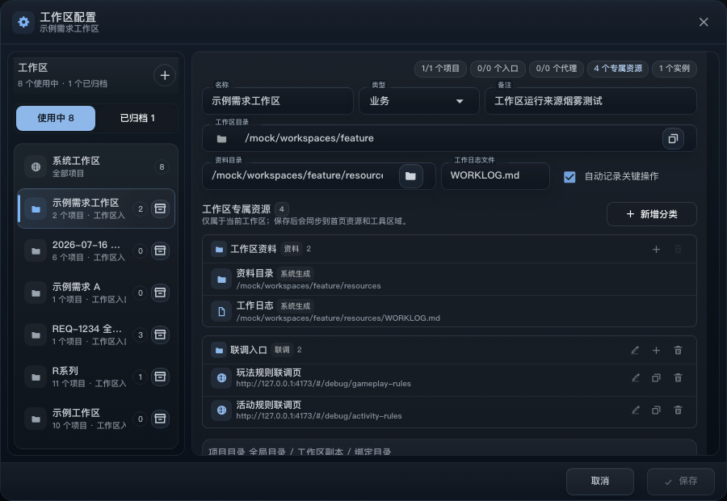

# rDevTool Complete User Guide

rDevTool is a local workbench for day-to-day development across multiple projects. It brings projects, branches, builds and deployments, resources, local proxies, running services, and execution history into one place, so you can review both the requested action and its actual result.

This guide follows real user tasks in the current interface. Screenshots use mock data and contain no real repository, intranet endpoint, or credential.

## Three Things To Understand First

- **Workspace** controls which projects, resources, proxies, and records are in scope. `system` is the global view; a regular workspace usually represents one requirement or a related group of projects.
- **Project** stores the repository folder, Git URL, local commands, build targets, launch profiles, and branch rules.
- **Action** is a reusable operation attached to a resource, such as batch deployment, an environment check, or a controlled local script. Each Action declares its own parameters, effect, and confirmation flow.

Switching workspaces does not modify a project. It changes the current scope. Always review the immutable workspace, target, and environment context shown at the top of a page or dialog.

## First-Time Setup

Use this order for a predictable first setup.

1. Open **Settings** in the top-right corner and start with **System Diagnostics**. Resolve blockers such as unreadable configuration, executable identity mismatch, or unhealthy storage.
2. Open **Project Management > Projects**, create or open a project, and enter its name, project key, repository folder, and Git URL.
3. Add local start and build commands. If the project has several environments, create launch profiles with the appropriate port, start page, and environment variables.
4. Under **Build**, add one or more build targets. A Jenkins target needs a connection profile and Job; a local target needs the correct command and working directory. Add branch, environment, select, or boolean parameters as required by that target.
5. Under **Git**, review the default target branch, sync targets, and protected-branch conventions.
6. Open workspace management from the switcher in the lower-left corner. Create a requirement workspace and select its projects, resources, and proxies. Keep using `system` if you do not need a narrower scope yet.
7. Open **Resources** and confirm that the current configuration source loads the expected websites, folders, apps, scripts, and Actions. When team and personal sources coexist, verify the source name shown in the page.
8. Run a read-only check or plan before push, merge, build, or deployment. After execution, confirm that the result was persisted in Record or the activity center.

Passwords, tokens, cookies, and private keys should come from environment variables or private local configuration. Do not put them in notes, the knowledge library, or ordinary command parameters.

## Navigation

The default sidebar contains **Workspace**, **Project Management**, **Resources**, **Local Proxy**, and **Knowledge**. Expanding Project Management reveals **Projects**, **Build**, and **Git**. The top-right controls open running activity and Settings. Press `Cmd/Ctrl + K` to search projects, resources, and common actions.

The **General** settings page controls the default page, visible menus, theme, interface language, and what happens to running projects when the app closes.

## Workspace Page

Workspace uses the app's default window ratio to keep the active requirement visible: project, resource, proxy, and Action counts stay at the top, content is grouped by type, and the lower-left switcher identifies the current workspace.

The Workspace page answers, "What am I working on right now?"

- Review the projects, resources, proxies, running state, and recent activity in the active workspace.
- Use the workspace switcher to enter `system` or a requirement workspace. Other pages refresh to the new scope after the switch completes.
- When creating a requirement workspace, select its project and resource scope and, when needed, set its root folder, resource folder, and worklog.
- If a workspace has project instances, review the effective folder and branch shown in the interface. Do not assume the system project folder is the current requirement copy.
- External configuration changes provide refresh or comparison actions. Finish or cancel current edits before changing sources or reloading.

At the start of a requirement, choose its workspace before opening Projects, Git, or Build. Return to `system` when you need to investigate across all projects.

For the complete workbench layout, Workspace Configuration dialog, project instances, and workspace-owned resources, continue with [Workspaces And The Workbench](workspace-guide_EN.md).

### Workspace-Owned Resources

Open **Workspace Configuration** to manage resources owned by the selected non-global workspace:

1. Select **Add Category**, then provide a category name and a short label for compact displays.
2. Add a website, directory, file, app, script, or tool. Tool entries may reference a Link, Action, Workflow, web action, or Runtime.
3. Use the edit, duplicate, and delete controls on each entry. Changes remain in the dialog draft until you select **Save**.
4. `Resource Directory` and `Work Log` are marked **Generated**. Their paths are controlled by the resource-directory and worklog settings above and cannot be removed accidentally from the list.

Keep these two scopes distinct:

- **Workspace-owned** entries are stored in the workspace configuration, apply only to that workspace, and can be created, edited, duplicated, or deleted here.
- **Shared resources** come from the selected resource configuration source and are included through the **Resources** scope below. Clearing the selection removes an entry from this workspace without deleting its source definition.

Save validates duplicate category and resource names together with URL, path, and entry-type requirements. The overview reloads its Resources and Tools sections after saving. Removing an entry that references an Action or Link does not delete the underlying Action or Link definition.

## Project Management

### Projects

Use the Projects page to find, run, and configure projects.

- Search by name, filter by category, and use favorites or recent items to find a project quickly.
- In project details, review the repository folder, current branch, and runtime state before opening the folder, starting, stopping, restarting, or focusing the app page.
- Project settings are organized around identity, local commands, launch profiles, build targets, and branch rules. The page reloads the effective configuration after a successful save.
- Start preflight checks the working directory, command, port, and local dependencies. Fix a reported blocker instead of repeatedly pressing Start.
- Use separate launch profiles for local, integration, or UAT modes. When switching profiles, review the port, environment, proxy, and start page together.

Each row has three layers: project identity and key on the left, repository path and command in the middle, and launch profile plus quick actions on the right. A green state means a rDevTool-managed runtime is running. External means a port exists but ownership is not verified. Unconfigured means you should add the command or folder before starting.

If a project appears unavailable, check that its repository folder exists, the active workspace points at the intended instance, and the configuration source loaded successfully.

For the full startup flow, launch profiles, runtime config, preflight, logs, and web actions, continue with [Project Startup And The Runtime Panel](project-runtime_EN.md).

### Build

The Build page uses one model for Jenkins, local commands, and R Series packaging: project + build target + parameters.

1. Choose a project and target.
2. Review the resolved working directory, Job, branch, environment, and parameter defaults in the plan.
3. Override only what this run needs. Empty fields continue to use the target default or current branch.
4. Confirm and start the operation. When a remote job is accepted, the result keeps its task or build link.
5. Review the newest state in Record. Expand the card for every parameter, default value, or repeated-run detail.

When a button changes from `Running` back to idle, it only means the current UI request ended. Confirm real execution through a new persisted operation, a remote task link, and the final Record state.

### Git

Use the Git page to inspect branch state and run sync, create, checkout, switch, merge, and push operations.

- Before an operation, verify the effective project folder, current branch, source branch, target branch, and uncommitted changes.
- Review the plan before a batch sync or merge. If one project is blocked, resolve that project instead of treating a partially valid plan as fully approved.
- Before push, review the upstream branch, changed files, and commit message. Return to the project folder when the worktree does not match your expectation.
- Completed merges, permission failures, and conflicts are all stored in Branch Record. Expand a record for complete branch values and recommended next actions per project.

## Resources And Reusable Actions

Resources brings websites, folders, apps, scripts, Links, and reusable Actions into one searchable page. Filter by type or category and use favorites or recent items for repeated work.

For the full behavior of websites, folders, files, scripts, tool keys, workspace scope, and the connection between Resources and Runtime Panel, continue with [Resources And Tool Entries](resource-guide_EN.md).

- Websites, folders, and apps open their configured target.
- A plain script starts its configured command. Tasks that need parameters, validation, or a structured result should use an Action.
- A Link combines local-file checks, proxy steps, runtimes, and page opening into one previewable debugging flow.
- If the page is empty or unexpected, verify the current workspace and resource configuration source before refreshing or opening source comparison.

The top metrics show how many entries exist in the active workspace, split by website, folder, and tool. Type tabs narrow the list; category chips group entries such as project links, automation, and external systems. The lightning action usually opens Action confirmation, the play action runs a Link or script, and the more menu covers favorites, copied paths, and configuration.

### Using An Action Dialog

1. **Review fixed context first.** Workspace, deployment target, and environment cannot be changed temporarily in the dialog. They identify the effective scope.
2. **Fill execution parameters.** Project multi-select keeps every selected item visible and wrapped, with Select All and Clear controls. A shared branch override only affects projects that declare a branch parameter; leaving it empty preserves the project default or current branch.
3. **Understand the execution mode.** Actions that support planning generate a read-only plan before confirmation and show effective targets and blockers. A Remote Write Action that still runs directly shows an additional warning.
4. **Confirm only the current result.** Changing parameters or the plan requires a fresh check; an older result is not reused.
5. **Watch the run.** Live logs are available while running, along with cancellation or background execution. Use result links and Record to confirm the final outcome.
6. **Retry carefully.** Only failures explicitly marked retryable expose retry. When a remote request has an ambiguous result, inspect the target system first to avoid a duplicate trigger.

## Local Proxy

The Local Proxy page manages listening addresses, ports, and rules by profile and shows runtime state and recent requests.

- Confirm that the listening port is free before starting a profile.
- Rules can forward, mock, block, or adjust requests and responses. Recheck profile state after editing rules.
- A project launch profile may reference a proxy. When debugging fails, inspect the project runtime, proxy state, matching rule, and upstream reachability together.
- Diagnostics help identify port conflicts, invalid URLs, invalid rules, or missing configuration sources. A running process alone does not prove that the request path works.

The service card on the left is a startable proxy profile; the right side contains rules for that profile. External occupation is not a successful start; it means the port is currently owned by a non-rDevTool process. Rule switches only decide whether the rule participates in matching. Creating, editing, importing, and exporting proxy packs modifies configuration, so review headers, cookies, and upstream addresses before sharing.

For service fields, rule matching, Forward/Mock/Block behavior, request history, diagnosis, import/export, and CLI details, continue with [Local Proxy: Services, Rules, And Requests](proxy-guide_EN.md).

## Knowledge

Knowledge stores reusable Markdown material in scopes such as Inbox, Project, Playbook, and Environment.

- Search and filter by scope. Select a project scope when you only want knowledge related to that project.
- Create a note from a template, preview its content, or continue editing in an external editor.
- Put verified start instructions, environment conventions, and resolved failures in Project knowledge; use Playbook for reusable procedures and Environment for cross-project setup.
- Never store tokens, cookies, private keys, or one-off business data. Knowledge is long-lived material that later tasks may read.

Prefer one clear question per note, such as "local proxy troubleshooting", "pre-release verification", or "how to start this environment". Use the left list to find material by time and scope, and the right preview to read it quickly. Edit in your local editor, then refresh the app when you return.

## Settings And System Diagnostics

Open **Settings** from the top-right corner for these user-facing areas:

- **General** controls visible menus, the default page, theme, interface language, and shutdown behavior for running services.
- **Operation Safety** uses Safety First, Recommended, Efficient, or per-operation rules to control pre-execution confirmation. Branch writes, remote releases, destructive deletion, and discarding unsaved content are safety guardrails that always require confirmation; builds, runtimes, proxies, and configuration imports can run directly or require confirmation. These are local interaction rules and do not replace GitLab, Jenkins, or operating-system permissions.
- **Shortcuts** opens configuration folders, workspace folders, and related configuration files.
- **Managed Artifacts** shows workspace instances, runtime state, logs, and referenced paths that rDevTool explicitly manages. Review the read-only plan before cleanup.
- **System Diagnostics** checks app/CLI identity, configuration health, storage use, and actionable risks.

Open project-specific start, build, and branch settings from **Project Management > Projects**. Resources, Actions, Links, proxies, and runtime settings may come from different configuration sources, so keep the currently displayed source in any troubleshooting notes.

## Activity Center And Record

The top-right **Running & Activity** view combines Actions, builds, Git, runtimes, proxies, Links, and external configuration changes. The **Record** section inside a task page is better for reviewing history of one operation type.

- Read the title, timestamp, and outer status first, then inspect project rows or the parameter summary.
- Use **All / Attention / Success / Failed** and **All origins / App / CLI / Tray** to narrow the view; the current activity center has no standalone keyword search or favorites filter.
- The Running view groups current-workspace, other-workspace, and shared services, with log, directory, port diagnosis, adopt, focus, and stop actions where available.
- Expand details for parameters, execution or chain timelines, diagnostics, per-project outcomes, and result links.
- Refresh reads running or build status again; cleanup only removes handled records and keeps attention and running items.
- Retry revalidates the current configuration and target. Do not assume historical parameters are still valid.

For the complete behavior of live resources, the attention queue, activity cards, evidence boundaries, and CLI counterparts, continue with [Running And Activity](activity-guide_EN.md).

### Build Page And Build Record

The screenshot shows the complete **Project Management > Build** page. The sidebar keeps the current location visible, the upper area selects the project, target, and effective parameters, and Record keeps the execution evidence below.

- Collapsed cards prioritize parameters that differ from defaults. Expanded cards show every effective and default value.
- Tokens, passwords, and other secrets only report whether they are configured.
- Jenkins permission, CSRF, and HTTP failures keep the status code and recommended checks visible.
- Repeated runs of the same target expand into a timeline with each build number and result.
- A pinned record keeps the normal card surface and uses a small label instead of a different result color.

### Git Page And Branch Record

The screenshot shows the complete **Project Management > Git** page. The upper area switches among merge, branch creation, commit and push, and working-copy management while keeping project and branch inputs visible; Branch Record stores each project outcome below.

- Each project in a batch task has its own row with source branch, target branch, and result.
- Long branches preserve their beginning and ending while collapsed and show the full value after expansion. Multi-project records preview three items and a remaining count.
- GitLab `HTTP 403` usually requires checking token API permissions, project membership and role, and protected-branch rules.
- A merge conflict is reported as not automatically mergeable. Resolve the conflict on the source branch, push it, and refresh the plan.

## Common States And Confirmation

| State | Meaning | Recommended action |
| --- | --- | --- |
| Ready / Can trigger | Parameters are resolved and the task can enter plan or execution | Recheck workspace, projects, and environment |
| Planning / Checking | rDevTool is building a read-only plan or checking targets | Wait for the plan; do not click repeatedly |
| Blocked | Plan or preflight found a blocker | Fix the per-project reason and create a new plan |
| Running | A local process or remote trigger is being handled | Watch live logs and the activity center |
| Success | This operation returned success | Open the result link when the remote terminal state matters |
| Failed | A concrete failure was returned | Review HTTP status, project rows, and diagnostics before retry |
| Cancelled | The user cancelled or execution was stopped | Check whether the remote system already accepted the request |
| Skipped | No work was needed or a rule skipped the item | Expand the reason; a risky skip can still block the task |

Push, merge, build, deployment, process stop, and cleanup may require confirmation. Before confirming, review the active workspace, project or instance folder, source and target branches, environment, effective parameters, plan expiry, and risk notice.

## Troubleshooting

### The UI Finished But No Task Actually Ran

1. Open runtime logs and confirm that planning, confirmation, and execution all occurred.
2. Look for a new operation in Activity or Record. No new persisted record usually means execution was not accepted durably.
3. Check for a remote task or build link. If one exists, inspect queue state in the target system.
4. Verify that workspace, configuration source, Action, or build target did not change immediately before execution.
5. Retry only after you can establish that the remote system did not accept the request.

### HTTP 403

- GitLab: check token API permission, project membership, role, and protected target-branch rules.
- Jenkins: check the account or token, Build permission on the Job, Crumb/CSRF setup, and Job address.
- A 403 is an explicit remote rejection, not a timeout. Fix permission or target details and create a new plan.

### Merge Conflict

Open the affected project, update the source and target branches, resolve conflicts on the source branch, commit, and push. Return to rDevTool, refresh branch observation, and build a new merge plan.

### Configuration Is Missing Or A Page Is Empty

Confirm that the active workspace includes the intended project or resource, then check the configuration source displayed by the page. Use System Diagnostics for missing files, invalid paths, duplicate ports, or unsupported capabilities. After an external edit, refresh or compare instead of overwriting unsaved work.

### Proxy Or Runtime Is Running But The Page Is Unavailable

Check process ownership, listening port, Ready/HTTP verification, proxy rule match, upstream reachability, and the configured start page in that order. A state of `started` does not mean HTTP verification succeeded.

## Data And Safety Boundaries

- rDevTool stores local configuration, workspace references, and operation history. It does not replace GitLab, Jenkins, or CI/CD.
- Secrets are not shown in full in Record, but they still should not be placed in notes, Knowledge, or regular parameters.
- rDevTool does not automatically repeat ambiguous remote writes. Inspect the target system before retrying.
- Workspace, project instance, and configuration source together determine the effective target. Fixed context shown before execution matters more than the entry label.
