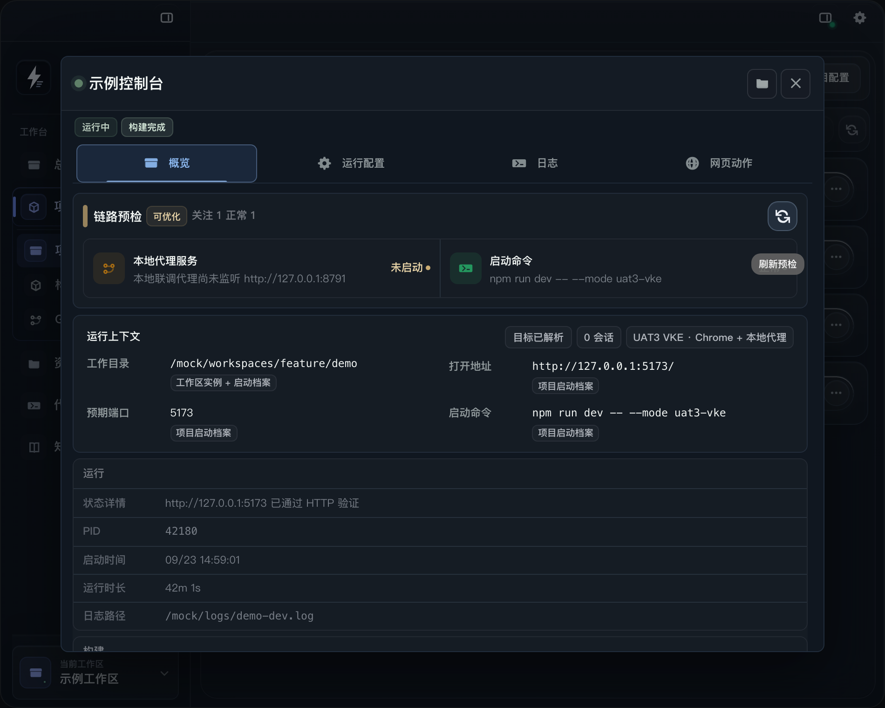
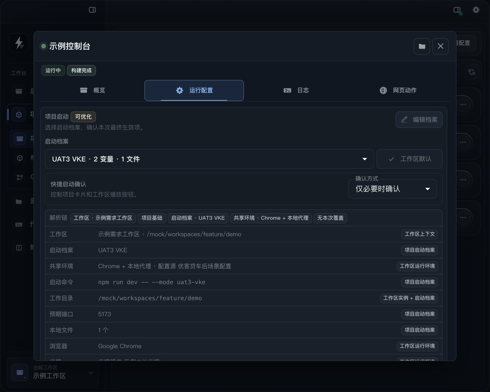

# 项目启动与运行面板

rDevTool 的项目启动流程由“项目启动档案”“运行环境模板”和“运行会话”三部分组成。项目页负责选择项目和启动档案，运行面板负责检查最终生效的启动链路、控制会话、查看日志和执行网页动作。



这篇文档适合第一次启动项目、需要切换联调环境，或遇到“进程已启动但页面不可用”时使用。

从工作区首页或资源入口触发 Runtime、Link 或网页动作时，资源入口负责发现和调用，运行面板负责确认最终生效的启动档案、运行环境、端口、日志和网页目标。资源入口的配置方式见 [资源入口与工具](resource-guide.md)。

## 1. 先理解三个配置层

| 对象 | 解决的问题 | 常见内容 |
| --- | --- | --- |
| 项目基础启动 | 项目默认怎么启动 | 项目目录、启动命令、默认端口和打开地址 |
| 启动档案 | 同一个项目如何切换运行方式 | 本地、Pre、UAT、端口、环境变量、启动页面和运行环境引用 |
| 运行环境模板 | 运行时需要哪些公共能力 | 浏览器、浏览器 Profile、用户数据目录、网络代理、本地代理、Host 解析和 CDP |

启动档案在界面中也叫 **Debug Profile**，运行环境模板在界面中也叫 **Runtime Profile**。两者不要混用：Debug Profile 描述“这个项目用什么命令启动”，Runtime Profile 描述“启动后如何访问浏览器和网络”。

一次启动最终会合并以下信息：当前工作区、项目实例目录、选中的启动档案、运行环境模板，以及本次启动临时覆盖。运行面板里的 **运行上下文** 才是最终生效值；项目列表上的标签只是快捷摘要。

## 2. 从项目列表启动

进入 **项目管理 > 项目**，每一行项目都会显示环境和档案标签，并提供启动、停止、打开项目目录和更多操作。

1. 先确认左下角当前工作区。需求工作区可能使用项目副本目录，不能只凭项目名称判断实际目录。
2. 查看项目行中的工作目录、启动命令、环境和档案标签。
3. 点击播放按钮可以按当前选择快捷启动；点击 **更多操作 > 选择档案启动** 可以明确选择本次档案。
4. 在启动弹窗中选择 **项目基础启动** 或具体启动档案，确认启动命令、工作目录、端口和共享环境；下方的摘要标签会显示档案变量数量以及网络代理、本地代理是否开启。
5. 根据需要选择快捷启动策略：**仅必要时确认**、**每次确认** 或 **直接启动**。高风险或不熟悉的项目建议保留确认。
6. 勾选 **设为当前工作区默认档案**，可以让该工作区后续快捷启动优先使用本次选择；这不会修改项目的全局默认配置。
7. 等待启动预检完成。预检有阻断项时，**启动项目** 按钮会保持不可用，应先修复并刷新检查。

启动弹窗会列出最多几个需要关注的检查项，例如命令、端口、本地代理和运行档案。它适合在真正启动前快速确认；需要完整证据时，打开项目的运行面板。

## 3. 运行面板概览

从项目行的 **更多操作 > 运行面板** 打开。面板顶部显示项目名、当前运行状态、构建状态和相关快捷操作；下面的标签分为 **概览**、**运行配置**、**日志**，配置了网页动作入口时还会显示 **网页动作**。

### 3.1 概览里的链路预检

概览顶部的 **链路预检** 会把当前启动条件拆成检查项，并统计异常、关注和正常数量。常见检查包括：

- 启动命令、工作目录和依赖是否可以解析。
- 预期端口是否空闲，是否被外部进程占用。
- 本地代理是否已经监听，项目绑定的 profile 是否一致。
- 网络代理、浏览器、Ready 探测和网页动作是否满足当前档案要求。
- 工作区选择的启动档案是否仍然存在，配置源是否可读。

点击刷新图标会重新执行预检。检查项带有修复入口时，优先使用界面提供的修复流程：例如启动绑定代理、清除失效档案选择、生成启动档案，或为本次启动换用空闲端口。

### 3.2 运行上下文和状态

**运行上下文** 用来区分三种事实：

- **请求**：本次调用要求的项目、启动档案、运行档案、命令覆盖、端口覆盖和环境覆盖。
- **最终生效**：经过工作区、项目、档案和临时覆盖合并后的工作目录、命令、打开地址、端口、Ready 探测和环境变量；每行都带来源标签（例如 项目启动档案、工作区运行环境）。
- **运行观测**：rDevTool 实际看到的 daemon 会话、runId、PID、阶段和运行时间。

配置存在风险时，上下文会以警告或错误列出；展开 **证据与建议动作** 可以查看证据来源和对应的 CLI 修复命令。

面板下方的运行区域还会显示 PID、启动时间、运行时长、日志路径、构建状态和构建输出目录。`运行中` 只说明进程状态，`HTTP 已验证` 或 Ready 成功才说明访问链路已经完成对应验证。

| 状态 | 含义 | 建议 |
| --- | --- | --- |
| 待配置 | 缺少目录或启动命令 | 进入项目配置补齐基础启动信息 |
| 可启动 | 目标已解析，预检允许启动 | 确认档案后启动 |
| 运行中 | rDevTool 正在管理会话 | 查看日志或聚焦页面 |
| 运行中（外部） | 端口有进程，但不是 rDevTool 创建的 | 先确认 PID 归属，不要直接停止 |
| 不可启动 | 预检发现阻断项 | 处理异常后重新预检 |

## 4. 运行配置：解析链、生效值与档案管理



运行配置页由两张卡片组成：**项目启动** 决定本次启动使用哪些配置，**共享运行环境** 管理可被多个启动档案复用的 Runtime Profile。关键值都带来源标签，用于回答“这个值是谁提供的”。

### 4.1 项目启动：选择档案并预览生效值

- **启动档案**：在“项目基础启动”和各 Debug Profile 之间切换，选项会标注变量和本地文件数量；右侧可以把当前选择 **设为工作区默认**，只影响本工作区的快捷启动，不修改项目全局默认。
- **快捷启动确认**：控制项目卡片和工作区播放按钮的确认方式，可选 **仅必要时确认**、**每次确认** 或 **直接启动**。
- **解析链**：按 工作区 → 项目基础 → 启动档案 → 共享环境 → 本次覆盖 展示每一层是否提供了覆盖；没有覆盖的层会显示“无启动档案覆盖”“无共享环境”“无本次覆盖”等占位。
- **生效值明细**：工作目录、启动命令、预期端口、本地文件、浏览器、代理等每行都带来源标签（例如 项目启动档案、工作区运行环境、工作区实例 + 启动档案）。排查配置问题时先读来源标签，再决定去项目配置还是工作区覆盖修改。
- **环境变量**：显示最终合并后的变量数量，展开后查看每个键的最终值。
- **本次启动覆盖**：按 `KEY=VALUE` 添加临时环境变量，只覆盖同名变量，不改写启动档案；确认可复用后点击 **保存为启动档案**，临时验证后可用 **清空覆盖** 撤销。
- 档案引用的共享环境缺失时会出现 **修复绑定** 提示；启动前检查未通过时，**启动项目** 按钮保持禁用。

### 4.2 共享运行环境：管理 Runtime Profile

共享运行环境卡片顶部显示作用范围（全局模板、工作区模板、继承全局 或 只读），并概括模板能力：浏览器、代理、域名映射与网页动作。点击 **管理模板** 展开后可以：

- 切换或刷新环境模板，新增、编辑模板；当前为工作区模板时提供 **恢复继承全局运行环境**。
- 通过标签查看模板要点：浏览器与 Profile、独立数据目录、绑定的代理服务或浏览器代理、域名映射和受控 CDP 端口。
- 查看 **绑定档案**：显示有多少项目启动档案正在使用该模板。调整或删除模板前先看绑定数量，避免影响其他项目。
- 展开后顶部会显示配置源条。外部编辑了 TOML 时，先刷新或重新选择配置源，避免用旧草稿覆盖新配置。

### Debug Profile 与 Runtime Profile 的选择建议

- 只改变启动命令、模式、端口或项目环境时，新增 Debug Profile。
- 只改变浏览器、代理、CDP 或网络访问方式时，复用或新增 Runtime Profile。
- 同一项目的 UAT 与本地模式通常需要不同 Debug Profile，但可以共享同一个浏览器和代理 Runtime Profile。
- 不要把真实 token 写入档案环境变量、网页动作脚本、备注或 Record。敏感信息应使用本机私有配置或环境变量注入。

## 5. 日志面板怎么用

切换到 **日志** 后，可以在 `dev` 和 `build` 之间切换。没有构建日志路径时，`build` 会被禁用。

日志区顶部依次展示：

- 当前日志路径，以及是否已经生成日志。
- 会话时间、PID、自动刷新状态和当前行数/总行数。
- 当前工作目录或启动命令，鼠标悬停可查看完整值。
- dev 日志对应的 Ready/HTTP 验证状态和 URL。

右上角按钮分别用于刷新、清空当前日志和复制日志路径。自动刷新适合观察启动过程；日志内容过长或页面卡顿时可以先暂停自动刷新，再用 CLI 做有边界的筛选。

建议按以下顺序读日志：

1. 先看命令是否在正确工作目录执行。
2. 再看端口绑定、依赖加载和编译是否完成。
3. 最后看 Ready 探测或打开地址是否成功。

进程退出但日志仍然存在时，日志可以帮助判断是命令失败、端口冲突、依赖错误还是应用本身启动后立即退出。清空日志只删除当前日志文件，不会删除项目配置或 Record。

## 6. 网页动作面板

项目配置了打开地址并启用网页动作后，运行面板会出现 **网页动作** 标签。它用于在受控浏览器目标上执行可重复的检查或请求，不等同于任意脚本执行。

面板包含以下区域：

1. **受控链路**：显示网页动作相关的预检结果。
2. **目标页面**：列出当前 Chrome 调试会话中的页面，可按标题、URL 和类型过滤；可以重新打开当前地址或刷新目标列表。
3. **已注册动作**：从当前配置源加载动作，显示动作名称、类型和参数。
4. **参数与执行**：选择目标页面，填写动作参数，点击运行并查看结构化结果。
5. **临时动作**：从新建菜单创建临时 HTTP 请求、脚本草稿，或导入 Chrome `Copy as fetch` 内容。HTTP 请求会先做方法、URL 和参数校验。
6. **配置与 CLI**：查看网页动作配置文件路径、打开配置文件，或复制当前动作的 CLI 命令用于终端复现。

网页动作排查建议：先确认目标页面已打开并且 URL 匹配，再确认 CDP 端口和浏览器 Profile，最后检查动作参数。动作结果成功只代表动作执行完成；页面最终业务状态仍需根据返回值、页面内容或下一步验证判断。

## 7. 启动后的常用动作

- **打开运行中的项目**：使用聚焦按钮打开档案中的 `focusUrl`；没有配置地址时只能查看日志。
- **停止项目**：只停止选中的 rDevTool 管理会话。外部占用必须先确认归属，不能用停止按钮代替进程管理。
- **重启项目**：适合修改本地配置或代理规则后重新建立会话。重启前仍会重新解析和预检。
- **认领外部项目**：只有明确知道 PID 和目录归属时使用。认领后 rDevTool 才能继续管理该会话。
- **打开项目目录**：用于确认实际工作区副本、锁文件和日志位置。

每次启动、停止、重启、认领和关键网页动作都会写入 Record 或活动记录。需要汇报或复盘时，保留项目、工作区、档案、运行 ID 和日志路径，而不是只截一张“运行中”的状态图。

## 8. CLI 对照流程

桌面界面不在身边时，可以使用 CLI 完成同一套检查。`<project>` 使用项目 Key，`<profile>` 使用 Debug Profile Key。

```bash
# 查看可用运行环境模板
rdevtool runtime profiles

# 解析请求和最终生效目标
rdevtool runtime inspect --project <project> --debug-profile <profile>

# 启动前检查
rdevtool runtime preflight --project <project> --debug-profile <profile>

# 预检通过后启动，并记录输出中的 runId
rdevtool runtime start --project <project> --debug-profile <profile>

# 查询会话、等待 HTTP 验证、查看日志
rdevtool runtime status --project <project> --run-id <runId>
rdevtool runtime wait --project <project> --run-id <runId> --until http-verified
rdevtool runtime log --project <project> --run-id <runId> --kind dev --tail 160

# 只看错误或匹配指定内容
rdevtool runtime log --project <project> --kind dev --errors-only
rdevtool runtime log --project <project> --grep "error" --tail 80

# 聚焦、诊断和停止选中的会话
rdevtool runtime focus --project <project> --run-id <runId>
rdevtool runtime diagnose --project <project> --run-id <runId>
rdevtool runtime stop --project <project> --run-id <runId>
```

如果使用 `--command`、`--runtime-profile`、`--expect-port` 或 `--env` 做一次性覆盖，应在 `preflight` 和 `start` 两个命令中重复同样的覆盖。这样检查的目标和真正启动的目标才一致。

## 9. 常见问题

### 预检提示端口被占用

先确认占用进程是不是当前项目或其他团队工具。属于外部进程时不要直接停止；可以在快速修复中改用建议端口，并选择是否同时保存为启动档案。启动成功后刷新运行上下文，确认打开地址和代理规则也使用了新端口。

### 显示运行中但网页打不开

按“工作目录和命令、监听端口、Ready/HTTP 验证、代理命中、上游地址、打开 URL”的顺序检查。`started` 只能说明进程已创建，不能替代 HTTP 验证。

### 本地代理显示未启动

在链路预检中使用启动代理修复，或进入 **本地代理** 页面确认 profile、监听地址和规则。代理绑定成功不代表规则一定命中；需要继续查看请求记录或执行真实验证。

### 启动档案显示失效

先在运行配置中重新选择有效档案。工作区覆盖中的失效选择可以使用快速修复恢复项目基础配置；确认无误后再保存新的工作区默认档案。

### 网页动作没有目标页面

先打开启动档案中的 `focusUrl`，再刷新目标列表。若仍为空，检查 Runtime Profile 是否启用了网页动作、CDP 端口是否冲突，以及当前浏览器是否使用了预期 Profile。

### 是否可以把运行日志提交到仓库

不要直接提交。日志可能包含本机路径、环境变量、请求参数和业务数据。对外分享前应脱敏，优先分享 Record 中的状态、命令摘要、错误类型和可复现步骤。
